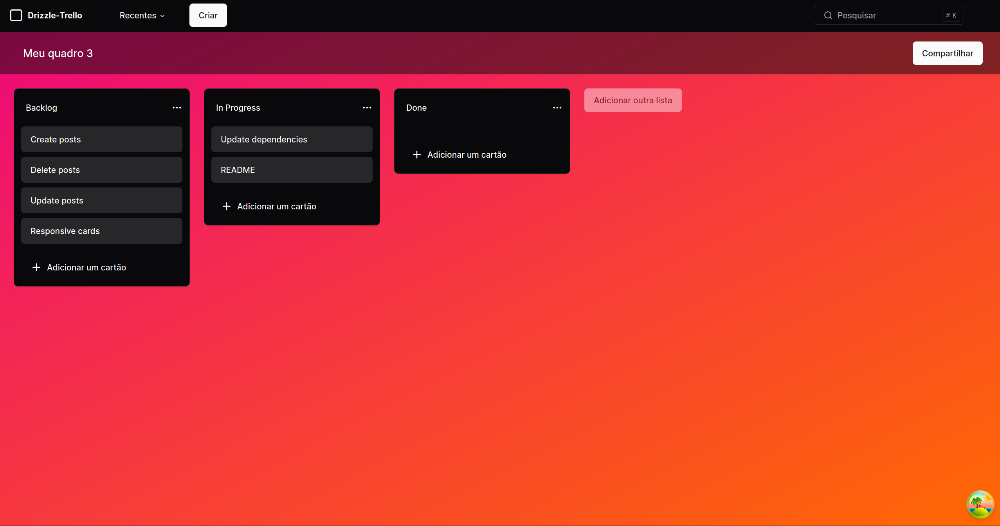

<p align="center">
  
</p>

### Trello-like Task Board built with Next.js, Drizzle ORM, shadcn and tRPC

## Features

- **Next.js 14** - A React framework with hybrid static & server rendering, and route pre-fetching
- **Drizzle ORM** - A simple and powerful ORM for TypeScript
- **tRPC** - A modern TypeScript-first API framework
- **mysql2** - A fast MySQL driver
- **Tailwind CSS** - A utility-first CSS framework
- **shadcn-ui** - An awesome component library
- **TypeScript** - JavaScript superset

## Getting started 🚀

The best way to start with this template is using `create-next-app`.

```
npx create-next-app my-app -e https://github.com/ricardovac/drizzle-trello
```

Alternatively, you can clone this repository and execute the following commands within the project folder:

1. `npm install` or `yarn`;
2. `yarn dev`;

To view the project open `http://localhost:3000`.

## Environment variables 🔑

Before running the project, rename the `.env.example` file to `.env` and fill in the following environment variables:

- `DB_HOST` - The database host
- `DB_USER` - The database user
- `DB_NAME` - The database name
- `DB_PASSWORD` - The database password

<br/>

- `NEXTAUTH_URL` - The URL of the NextAuth.js provider
- `NEXTAUTH_SECRET` - The secret used to encrypt the cookies

<br/>

- `GOOGLE_CLIENT_ID` - The Google OAuth client ID
- `GOOGLE_CLIENT_SECRET` - The Google OAuth client secret

## Star ✨

Please express your support by starring it. Thank you!

## Contributing 🤝

1. Fork this repository;
2. Create your branch: `git checkout -b my-new-feature`;
3. Commit your changes: `git commit -m 'Add some feature'`;
4. Push to the branch: `git push origin my-new-feature`.

**Once your pull request is merged**, feel free to delete your branch.

Made by ricardovac
